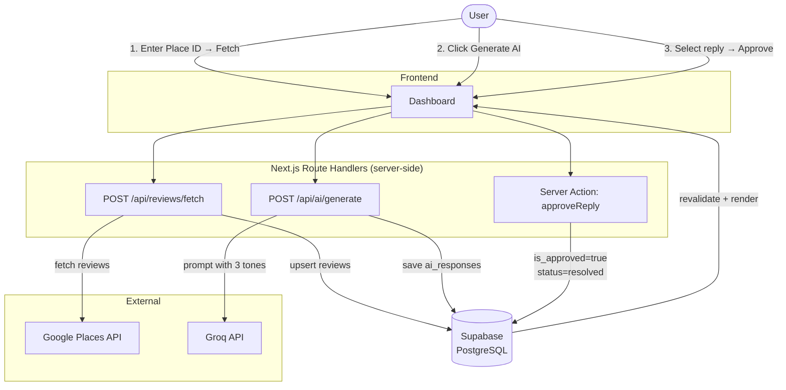

# ReviewPilot

Fetch Google reviews by Place ID → generate AI reply drafts (3 tones) → approve in one click.

**Live demo:** [review-pilot-six.vercel.app](https://review-pilot-six.vercel.app/dashboard)

---

## Stack

| | |
|---|---|
| Framework | Next.js 16 (App Router) + TypeScript |
| Database | Supabase (PostgreSQL) |
| AI | Groq (llama-3.3-70b-versatile) |
| UI | Tailwind CSS 4 + shadcn/ui |
| Validation | Zod |

## Architecture



All external API calls (Google Places, Groq) run server-side — no API keys are ever exposed to the browser.

---

## Local Setup

```bash
git clone https://github.com/tvthanh2k3/review-pilot.git
cd review-pilot
npm install
cp .env.example .env.local   # fill in your keys
```

Run `supabase/migrations/001_init.sql` in your Supabase SQL Editor, then optionally `supabase/seed.sql` for sample data.

```bash
npm run dev   # → http://localhost:3000/dashboard
```

---

## Environment Variables

See `.env.example` for the full list. Required:

- `NEXT_PUBLIC_SUPABASE_URL` / `NEXT_PUBLIC_SUPABASE_ANON_KEY` — Supabase project API
- `SUPABASE_SERVICE_ROLE_KEY` — server-only
- `GROQ_API_KEY` — server-only
- `GOOGLE_PLACES_API_KEY` — requires **Places API (New)** enabled in Google Cloud Console

---

## Trade-offs & Decisions

See [DECISIONS.md](./DECISIONS.md).
